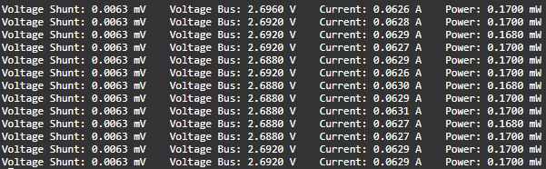

<div style = "font-family: 'Open Sans', sans-serif; font-size: 16px">

# ModulePowerINA219
<div style = "color: #555">
    <p align="center">
    
    </p>
</div>

# Лицензия
////

# Описание
<div style = "color: #555">

Модуль предназначен для работы с датчиком силы тока и напряжения на базе чипа [INA219](https://github.com/Konkery/ModulePowerINA219/blob/main/res/INA219_Datasheet.pdf). Модуль является неотъемлемой частью фреймворка EcoLite. Датчик на баз чипа INA219 позволяет получить данные о напряжении, силе тока и мощности. Модуль работает по интерфейсу I2C. Модуль имеет следующие архитектурные решения фреймворка EcoLite:
- является потомком класса [ClassMiddleSensor](https://github.com/Konkery/ModuleSensorArchitecture/blob/main/README.md);
- создаёт шину через глобальный объект [I2Cbus](https://github.com/Konkery/ModuleBaseI2CBus/blob/main/README.md).

Количество каналов для снятия данных - 4.
</div>

### Конструктор
<div style = "color: #555">

Конструктор принимает 1 объект типа **SensorOptsType** и 1 объект типа [**SensorOptsType**](https://github.com/Konkery/ModuleSensorArchitecture/blob/main/README.md):
```js
let sensor_props = {
    name: "INA219",
    type: "sensor",
    channelNames: ['vshunt', 'vbus', 'current', 'power'],
    typeInSignal: "analog",
    typeOutSignal: "digital",
    quantityChannel: 4,
    busType: [ "i2c" ],
};
const _opts = {
    bus: i2c_bus,
    address: 0x40,
}
```
- <mark style="background-color: lightblue">bus</mark> - объект класса I2C, возвращаемый диспетчером I2C шин - [I2Cbus](https://github.com/Konkery/ModuleBaseI2CBus/blob/main/README.md);
- <mark style="background-color: lightblue">address</mark> - адрес датчика на I2C шине. Нужен в случае присутствия нескольких датчиков INA219.
</div>

### Поля
<div style = "color: #555">

- <mark style="background-color: lightblue">_Name</mark> - имя класса в строковом виде;
- <mark style="background-color: lightblue">_Sensor</mark> - объект базового класса;
- <mark style="background-color: lightblue">_MinPeriod</mark> - минимальная частота опроса датчика - 250 мс;
- <mark style="background-color: lightblue">_UsedChannels</mark> - используемые каналы данных по нотации архитектуры фреймворка EcoLite;
- <mark style="background-color: lightblue">_Interval</mark> - функция SetInterval для опроса датчика.
</div>

### Методы
<div style = "color: #555">

- <mark style="background-color: lightblue">Init(_sensor_props)</mark> - метод обязывающий провести инициализацию датчика;
- <mark style="background-color: lightblue">Start(_num_channel, _period)</mark> - метод запускает циклический опрос определенного канала датчика с заданной периодичностью в мс. Переданное значение периода сверяется с минимальным значением, хранящимся в поле *_MinPeriod*, и, если требуется, регулируется;
- <mark style="background-color: lightblue">ChangeFreq(_num_channel, _period)</mark> - метод останавливает опрос указанного канала и запускает его вновь с уже новой частотой.
- <mark style="background-color: lightblue">Stop(_num_channel)</mark> - метод прекращает считывание значений с заданного канала.
</div>

### Возвращаемые данные
<div style = "color: #555">

Датчик предоставляет данные о напряжении тока в вольтах (V) на шине, и в миливольтах (mV) на шунте, силе тока в милиамперах (mA) и мощности в миливаттах (mW).
</div>

### Примеры
<div style = "color: #555">

Фрагмент кода для вывода данных о давлении и температуре в консоль раз в одну секунду. Предполагается, что все необходимые модули уже загружены в систему:
```js
//Создание объекта датчика
let ina = SensorManager.CreateDevice("07");
ina[0].Start(1000);
ina[1].Start(1000);
ina[2].Start(1000);
ina[3].Start(1000);

// Вывод данных
setInterval(() => {
  console.log(`Voltage Shunt: ${(ina[0].Value).toFixed(4)} mV    Voltage Bus: ${(ina[1].Value).toFixed(4)} V    Current: ${(ina[2].Value).toFixed(4)} A    Power: ${(ina[3].Value).toFixed(4)} mW`);
}, 1000);
```
Вывод данных в консоль:
<p align="left">
  
</p>
<div>

# Зависимости
- [ClassBaseI2CBus](https://github.com/Konkery/ModuleBaseI2CBus/blob/main/README.md)
- [ModuleAppError](https://github.com/Konkery/ModuleAppError/blob/main/README.md)
- [ModuleAppMath](https://github.com/Konkery/ModuleAppMath/blob/main/README.md)


</div>